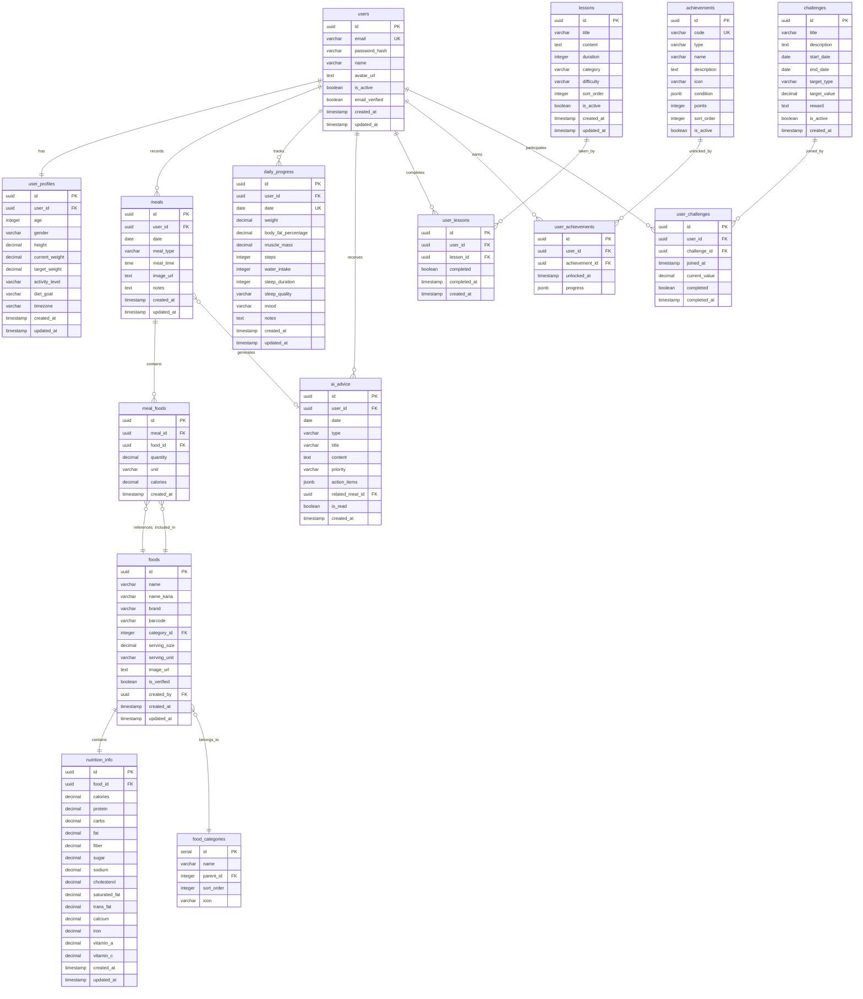

# ダイエットアプリ ER図

## ER図（Mermaid形式）

## テーブル関係の説明

### 1. ユーザー関連
- **users** - **user_profiles**: 1対1の関係。各ユーザーは1つのプロフィールを持つ
- **users** - **meals**: 1対多の関係。1人のユーザーは複数の食事記録を持つ
- **users** - **daily_progress**: 1対多の関係。1人のユーザーは複数の日次進捗を持つ

### 2. 食品・食事関連
- **foods** - **nutrition_info**: 1対1の関係。各食品は1つの栄養情報を持つ
- **foods** - **food_categories**: 多対1の関係。複数の食品が1つのカテゴリに属する
- **meals** - **meal_foods**: 1対多の関係。1つの食事は複数の食品を含む
- **meal_foods** - **foods**: 多対1の関係。食事内容は食品マスタを参照

### 3. 学習・達成関連
- **users** - **user_lessons**: 1対多の関係。ユーザーは複数のレッスンを受講
- **lessons** - **user_lessons**: 1対多の関係。1つのレッスンは複数のユーザーが受講
- **users** - **user_achievements**: 1対多の関係。ユーザーは複数のアチーブメントを獲得
- **achievements** - **user_achievements**: 1対多の関係。1つのアチーブメントは複数のユーザーが獲得可能

### 4. AI・アドバイス関連
- **users** - **ai_advice**: 1対多の関係。ユーザーは複数のAIアドバイスを受信
- **meals** - **ai_advice**: 1対多の関係。食事に基づいてアドバイスが生成される（optional）

### 5. チャレンジ関連
- **users** - **user_challenges**: 1対多の関係。ユーザーは複数のチャレンジに参加
- **challenges** - **user_challenges**: 1対多の関係。1つのチャレンジに複数のユーザーが参加

## 主要な制約とビジネスルール

1. **一意性制約**
   - users.email: メールアドレスは一意
   - (user_id, date, meal_type) in meals: 1日の同じ食事タイプは1つのみ
   - (user_id, date) in daily_progress: 1日1つの進捗記録

2. **参照整合性**
   - すべての外部キーは親テーブルの存在を保証
   - カスケード削除は原則使用せず、論理削除を推奨

3. **データ整合性**
   - meal_type: breakfast, lunch, dinner, snack のみ
   - gender: male, female, other のみ
   - activity_level: sedentary, light, moderate, active, very_active のみ

## パフォーマンス考慮事項

1. **頻繁にJOINされるテーブル**
   - meals ⟷ meal_foods ⟷ foods
   - users ⟷ daily_progress
   - foods ⟷ nutrition_info

2. **大量データが予想されるテーブル**
   - meals: パーティショニング推奨
   - meal_foods: インデックス最適化必須
   - ai_advice: 古いデータのアーカイブ検討

## 拡張性の考慮

1. **将来的な機能追加に備えた設計**
   - JSONB型の活用（action_items, condition, progress）
   - カテゴリの階層構造（parent_id）
   - 汎用的なtype, status フィールド

2. **国際化対応**
   - name_kana: 日本語検索用
   - timezone: ユーザーごとのタイムゾーン
   - 多言語対応は別テーブルで管理可能